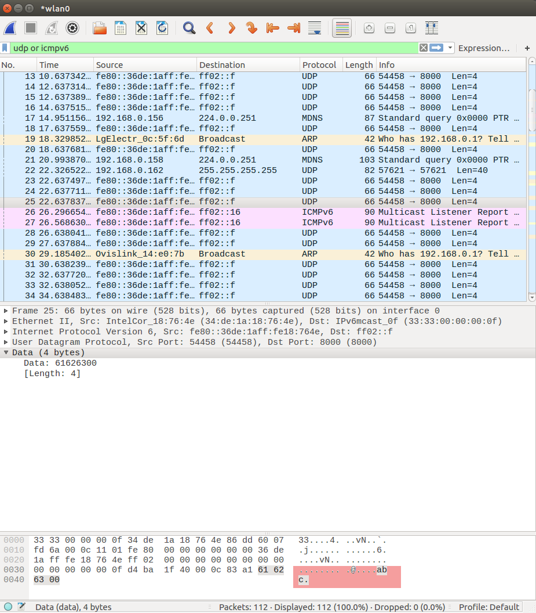
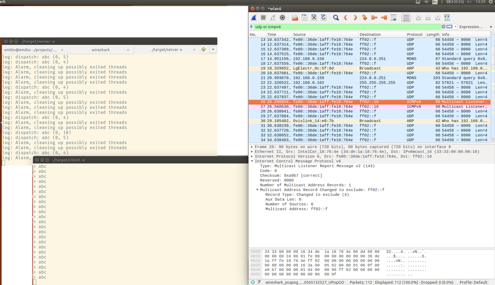
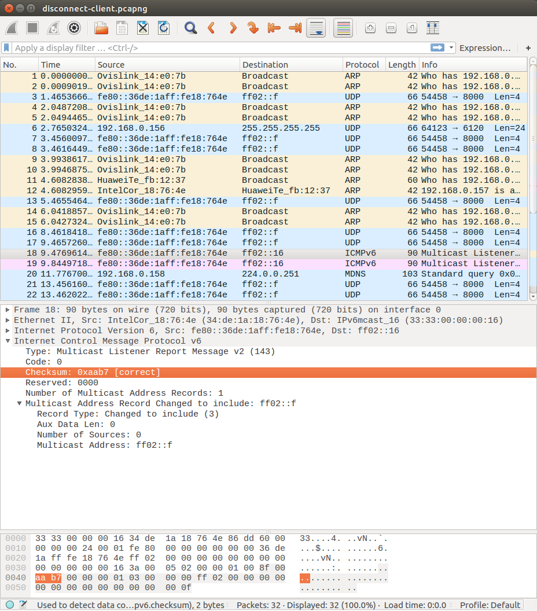
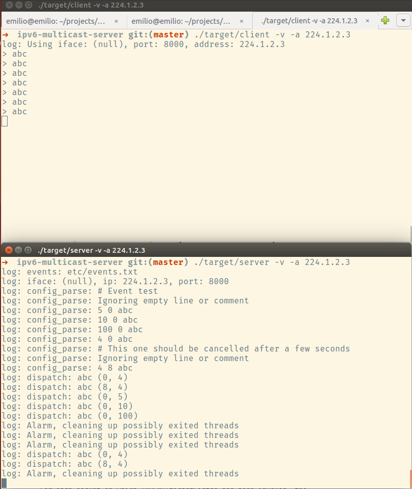
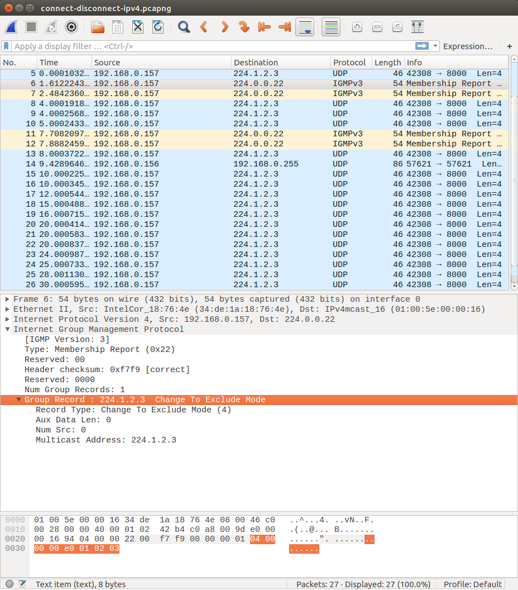
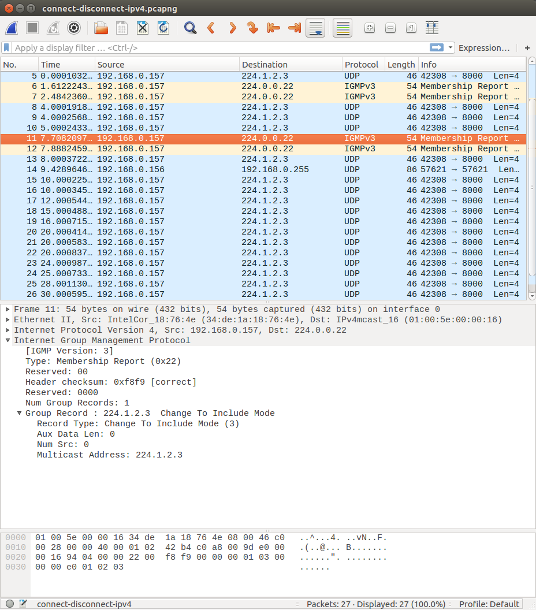

# Implementación

## Modelo de servidor

El modelo de servidor es el propuesto, con capacidad para ser un daemon con el
flag `-d`, y con capacidad de recargar la configuración en el aire (usando la
señal `SIGHUP`), de salir limpiamente y sin leaks, usando (`SIGTERM`
o `SIGINT`), y de limpiar hilos muertos (que ya han terminado de ejecutarse)
automáticamente.

### Formato y lectura de la configuración

El formato de la configuración es algo diferente al propuesto, siendo:

```
<r> <d> <desc>
```

Donde `<r>` es la velocidad de repetición, `<d>` es el tiempo durante el cual se
repetirá, y `<desc>` es la descripción del evento.

Se ha escogido este formato porque a ojos del autor es mucho más fácil de leer,
y no impone ningún separador que pudiera entrar en conflicto con la descripción.

Se ha creado un tipo de datos (`event_list_t`), que es una lista enlazada con
eventos. La idea de este tipo de datos era no tener que crear un thread por
evento, sino manipular la lista directamente (leyendo el próximo evento
a mostrar, y reordenando) para ser más eficiente. No obstante tras varias
preguntas se instó a hacerlo con threads.

## Creación de los sockets

La creación de sockets se encuentra en el archivo `socket-utils.c`, y es
bastante directa. **Soporta tanto IPv4 como IPv6**, seleccionando interfaces
o usando la interfaz por defecto.

# Capturas de tráfico del servidor

## Nota previa acerca de las capturas

Tras haber realizado las capturas, al ir a comprobar que la dirección multicast
a la que se mandaban los paquetes de inclusión/exclusión era la correcta, me di
cuenta de que estaba usando una dirección multicast reservada para mis pruebas,
concretamente la dirección multicast para UPnP.

Afortunadamente, el router de mi red local no tenía activado UPnP, por lo que no
hubo ningún conflicto. No obstante, la dirección se ha actualizado para usar una
no reservada en el código final.

## Datos enviados al grupo multicast



Se puede comprobar cómo el paquete está enviado desde mi dirección local a la
dirección multicast. Se puede comprobar como se encuentran los datos originales
(la cadena `abc` y el byte nulo final).

## Conexión al grupo multicast



Arriba se puede comprobar el mensaje enviado a la dirección `ff02::16`, la
dirección reservada para MLDv2 (*Multicast Listener Discovery*), que sirve
para comunicarle al router nuestra intención de escuchar los mensajes a esa
dirección.

El mensaje es un mensaje para configurar la dirección `ff02::f` en modo
`EXCLUDE` con una lista de fuentes vacía (`Number of Sources: 0`), de tal manera
que el router cambia esa dirección al modo `EXCLUDE` con una lista vacía (de tal
manera que ninguna de las direcciones que envían a esa lista sean excluidas).

Esto se corresponde con la sección 3 del [RFC
3810](https://tools.ietf.org/html/rfc3810) correspondiente:

> The Start Listening operation is equivalent to:
>
>> IPv6MulticastListen ( socket, interface, IPv6 multicast address,
>>                       EXCLUDE, {} )
>
> where {} is an empty source list.

## Desconexión al grupo multicast



Igualmente, cuando el cliente se desconecta, se manda un mensaje de para
configurar la dirección en modo `INCLUDE`, con una lista vacía de receptores, es
decir, que no envíe a nuestro host mensajes a esa fuente que vengan de los hosts
que estén incluídos en esa lista (es decir, ninguno).

Esto también se corresponde con la misma sección del RFC:

> and the Stop Listening operation is equivalent to:
>
>> IPv6MulticastListen ( socket, interface, IPv6 multicast address,
>>                       INCLUDE, {} )
>
> where {} is an empty source list.

# Funcionamiento en IPv4

Se ha hecho la prueba de funcionamiento escuchando a la dirección `224.1.2.3`
(completamente aleatorio):



## Conexión y desconexión al grupo multicast




El funcionamiento es similar, se manda un paquete para cambiar al modo `EXCLUDE`
cuando se empieza a escuchar, y otro para cambiar al modo `INCLUDE` cuando te
desconectas.

# Capturas y adjuntos

Todas las capturas (tanto de pantalla como de tráfico) pueden ser encontradas en
respectivos directorios en la carpeta `docs/`.
